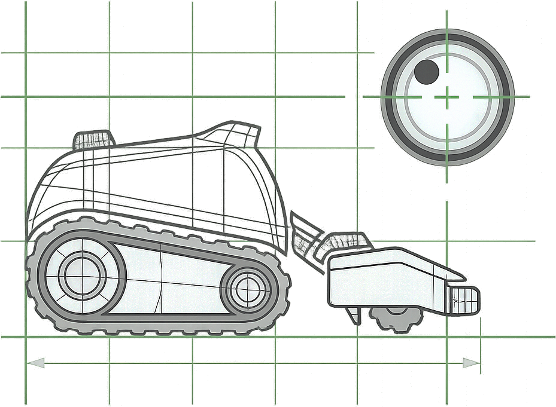

# Virtual Lymow Home Assistant Custom Integration </img>

HACS-style custom integration for Virtual Lymow mowers using the hidden RTSP endpoint:

`rtsp://<MOWER_IP>:10022/h264ESVideoTest`

## What it creates

- `sensor.mower_status` (`Mowing`, `Docked`, `Idle`, `Unknown`, `Charging`)
- `binary_sensor.mower_motion`
- `binary_sensor.mower_docked_guess`
- `camera.mower_snapshot`
- `select.mower_state` (`Mowing`, `Docked`, `Idle`, `Unknown`, `Charging`, `Auto`) for override/debugging

`Charging` is a manual status override. You can set it from automations (for example, when a smart plug detects high charging power draw), then set state back to `Auto` when charging ends.

## Design

- Native `DataUpdateCoordinator`
- Polling snapshots every _N_ seconds (configurable)
- One-shot `ffmpeg` snapshots (no continuous stream)
- Built-in grayscale frame differencing motion detection
- Pillow-only dock marker detection (no OpenCV/native dependency)

## Install (HACS)

1. Add this repo as a **Custom repository** in HACS (type: **Integration**).
2. Install **Virtual Lymow** from HACS.
3. Restart Home Assistant.
4. Add integration: **Settings → Devices & Services → Add Integration → Virtual Lymow**.
5. Enter mower IP and tuning options.

## Tuning

- **Polling interval**: lower = fresher updates, higher Lymow battery drain.
- **Motion threshold**: higher = less sensitive movement detection.
- **Still polls before docked guess**: how many no-motion updates trigger docked guess.
